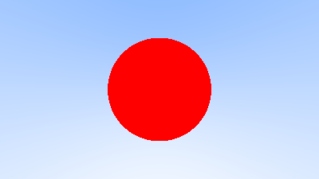
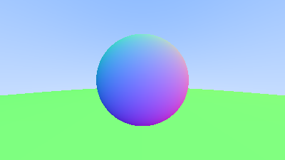
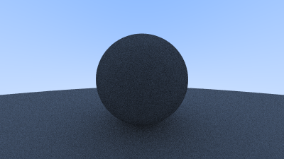

# myOwn-one-weekend-ray-tracing   
The repository is for learning ray tracing.   
All code is basded on [RTOW](https://raytracing.github.io/)   
### Futher reading   
That's because our eyes are naturally doing what we want our ray tracer to do: [Spatial frequency analsis in early visual processing](https://royalsocietypublishing.org/rstb/article-abstract/290/1038/11/41808/Spatial-frequency-analsis-in-early-visual?redirectedFrom=PDF)   
[Recommended Further Reading](https://github.com/RayTracing/raytracing.github.io/wiki/Further-Readings)
<figure>
    
    <figcaption>Result: a ray traced image.</figcaption>
    
    <figcaption>Result: rednering a sphere with normal colored.</figcaption>
    
    <figcaption>Result: anti-aliasinged-image.</figcaption>
    
    <figcaption>Result: PBR with some noises.</figcaption>
</figure>